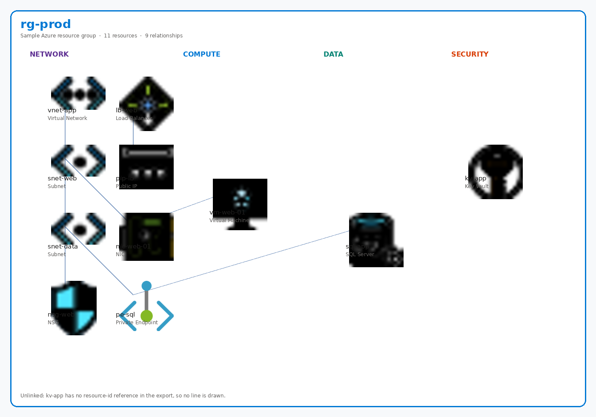

# azure-skill

Agent skills for Azure work.

## azure-rg-diagram

Read-only skill that inventories an Azure resource group (or an ARM / Resource Graph export) and generates an infrastructure diagram with Azure architecture icons.

Outputs:

- `diagram.html` — layered diagram, Azure icons, relationship lines
- `diagram.drawio` — same icons, editable in diagrams.net
- `inventory.md` — resources and inferred relationships

No Mermaid output. Edges are drawn only when one resource's properties contain another resource's ID. The skill does not deploy or modify Azure resources.

```bash
azure-rg-diagram/scripts/collect_rg.sh <resource-group> [subscription] ./azure-rg-export
python3 azure-rg-diagram/scripts/build_diagram.py \
  --input ./azure-rg-export/resources.json \
  --out ./azure-rg-export/diagram \
  --title "<resource-group>"
```

Open `diagram.html` in a browser. Open `diagram.drawio` in [diagrams.net](https://app.diagrams.net/).

## Sample run

Input: `azure-rg-diagram/assets/sample-rg.json` (`rg-prod`: VNet, two subnets, NSG, load balancer, public IP, NIC, VM, private endpoint, SQL server, Key Vault).

```bash
python3 azure-rg-diagram/scripts/build_diagram.py \
  --input azure-rg-diagram/assets/sample-rg.json \
  --out ./sample-out \
  --title rg-prod
```

Result: **11 resources, 9 edges**. Nested subnets are expanded. Key Vault stays unlinked because the export has no resource-id reference to it.



Preview the generated picture: [sample-out/diagram.html](sample-out/diagram.html). Editable file: [sample-out/diagram.drawio](sample-out/diagram.drawio).

Layout is columns left to right: network, compute, data, security. Each node is an Azure architecture icon plus the resource name. Key Vault is drawn with its icon and left unlinked.

Relationships:

- vnet-app → snet-web, snet-data, nsg-web
- snet-web → nsg-web
- lb-web → pip-lb
- nic-web-01 → snet-web
- vm-web-01 → nic-web-01
- pe-sql → snet-data, sql-app
- unlinked: kv-app
